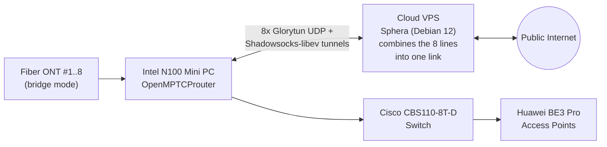
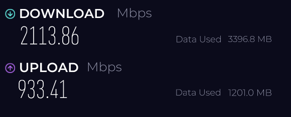
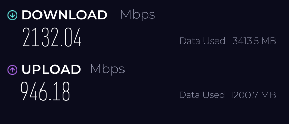

# OpenMPTCProuter – Multi-WAN Bandwidth Aggregation

Advanced multi-WAN bonding infrastructure that aggregates 8 high-speed Fiber (ONT) connections into a single, unified, high-performance pipeline — delivering maximum aggregate bandwidth, ultra-low latency variation, zero-downtime failover, and high availability through multipath routing and a cloud-hosted VPS.

## Overview

This project combines 8 independent fiber internet lines into one logical connection using [OpenMPTCProuter](https://www.openmptcprouter.com/), an open-source Multipath TCP/UDP bonding solution. The result is a single aggregated link with substantially higher throughput and built-in redundancy — if any individual line drops, traffic reroutes seamlessly across the remaining links with no downtime.

## Motivation

Commercial fiber offerings in Saudi Arabia currently top out at **1 Gbps download / 300 Mbps upload**, since **XGS-PON** is not yet available commercially — it's currently limited to scientific and research use only. The underlying access technology is **G-PON** (ITU-T G.984), which has a theoretical downstream ceiling of **2,488 Mbps**, shared across all subscribers on that optical distribution network. With no single-line commercial option beyond 1 Gbps, and a hard network-level ceiling around 2,488 Mbps regardless of technology, bonding multiple standard fiber lines was the practical way to approach that ceiling and reach multi-gigabit aggregate speeds.

## Architecture

## Tech Stack

| Component | Technology / Hardware | Role |
|---|---|---|
| Cloud VPS | Sphera (Debian 12) | External aggregation endpoint; merges multipath traffic and routes it to the public internet |
| Local Router | Intel N100 Mini PC (OpenMPTCProuter) | Core multi-WAN gateway; manages traffic distribution and tunnel encapsulation across all 8 lines |
| Bonding Protocols | Glorytun UDP & Shadowsocks-libev | High-throughput multipath tunnel with minimal CPU overhead |
| Switching & APs | Cisco CBS110-8T-D, Huawei BE3 Pro | Enterprise-grade local switching and wireless coverage |
| Internet Inputs | 8× Fiber (ONT) lines | Configured in bridge mode to remove internal bottlenecks and maximize raw throughput |

## Results

- **8 fiber lines bonded** into a single logical connection
- Each individual line is subscribed at the ISP's base package speed of **300 Mbps download / 100 Mbps upload**
- **~2,100 Mbps aggregate download** and **~940 Mbps aggregate upload** achieved after bonding — roughly a 7x gain over a single line
- **Zero-downtime failover** — traffic reroutes automatically if a line drops
- Bottlenecks, VLAN translation issues, MTU sizing, and failover behavior all tuned and resolved

### Speed Test Results

| Test | Download | Upload |
|---|---|---|
| Single line (baseline, subscribed package) | 300 Mbps | 100 Mbps |
| Aggregated — Run 1 | 2113.86 Mbps | 933.41 Mbps |
| Aggregated — Run 2 | 2132.04 Mbps | 946.18 Mbps |

  
  

## Key Skills Demonstrated

- Advanced network engineering — architecting multi-WAN aggregation across 8 simultaneous fiber links
- Multipath routing & VPN tunneling — configuring and tuning a Linux (Debian 12) VPS with Glorytun/Shadowsocks
- Performance optimization — eliminating bottlenecks, resolving VLAN issues, tuning MTU and failover logic

## Acknowledgements

This project would not have been possible without [OpenMPTCProuter](https://www.openmptcprouter.com/), the open-source multipath bonding solution created and maintained by French developer **Yannick Chabanois** (known as **Ycarus**) since 2018. His work — and the bonding recipe he documented for combining multiple WAN links through Glorytun UDP/Shadowsocks tunnels — is the foundation this entire setup is built on. Many thanks to him for making this technology open and accessible.

## Disclaimer

This repository documents a personal home-network engineering project. It does not include configuration secrets, credentials, or provider-specific account details.

---
*Documented as part of a personal network engineering portfolio.*
